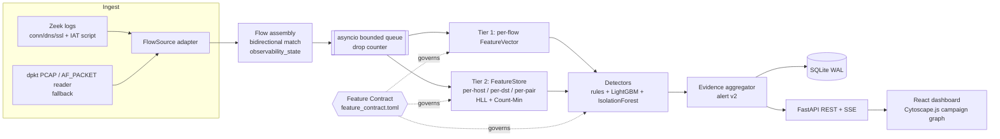

# SIH26145 — Target Architecture

**Problem statement:** SIH 2026 PS 26145 (NTRO) — AI-based detection of cyber threats in
unidirectional IP traffic.
**Status:** target design as of 2026-09-26. §15 marks what is implemented and what is not.
**Companion documents:** `docs/AUDIT.md` (defects in the intake baseline),
`src/sih26145/feature_contract.toml` (the Unidirectional Feature Contract), `TODO.md`.

---

## 1. Pass/fail constraints

| ID | Constraint | Where it is enforced |
|---|---|---|
| RO | Read-only ingest, no return path | §2, §14. No transmit socket anywhere in `src/`; `tests/ingest/test_security_boundary.py` |
| ND | No payload decryption | §6 contract: decryption-dependent features are `unavailable` |
| SL | Streaming with bounded latency | §9 bounded queue, idle flush |
| TP | Stated and demonstrated throughput | §13 — flows/sec and Mbps, measured, hardware stated |
| AS | Structured alert schema | §10 alert v2 |
| (a)–(f) | Six threat classes | §8 |

## 2. Capture model

"Unidirectional" describes the **enclave**: it never transmits, probes, or completes a
handshake of its own. It does **not** describe the capture. The enclave sees whatever
crosses the link:

- a full-duplex tap delivers **both halves** of each conversation;
- asymmetric routing, or a single-direction SPAN port, delivers **one half**.

The system cannot know in advance which it has, and a single link can mix both (some
routes symmetric, some not). So it measures visibility **per flow** from the traffic
itself (§5) and every feature declares what it needs (§6). No detector assumes either case.

## 3. System overview



## 4. Ingest

One adapter, `FlowSource`, yields flow records to the rest of the system. Two
implementations sit behind it:

**Zeek (primary).** Zeek is the mature, audited parser for a sensor. The adapter tails
Zeek JSON logs:
- `conn.log` → flow identity, `orig_bytes`/`resp_bytes`, `orig_pkts`/`resp_pkts`,
  `history`, `conn_state`, `community_id`. Reverse visibility maps directly: a connection
  whose `history` contains only upper-case letters (originator side) and `resp_pkts == 0`
  is forward-only; `conn_state` `S0`/`SH`/`OTH` are the one-sided states.
- `dns.log` → query, qtype, and — when responses were captured — `rcode`.
- `ssl.log` → SNI, version, JA3/JA3S, and JA4 via the FoxIO Zeek package (JA4 client only;
  see §14).
- Per-flow inter-arrival statistics are **not** in `conn.log`. A small Zeek script emits
  them; without it those features are `degraded` under Zeek ingest (contract `sources`
  column).

**dpkt (fallback).** The existing `PcapReader` → `PacketParser` → `FlowTracker` path. Used
for PCAP replay, tests, and any host without Zeek. It is the only path implemented today.

Both adapters must produce the same flow semantics; the contract's `sources` column says
which adapter yields each feature.

## 5. Flow assembly and per-flow observability

- Flow key: 5-tuple `(src_ip, src_port, dst_ip, dst_port, proto)` oriented by the first
  observed packet.
- A packet whose **reverse** 5-tuple matches an active flow is attached to that flow as the
  reverse direction. `FlowRecord` keeps `fwd_packets/bytes`, `rev_packets/bytes`,
  per-direction TCP flags, first SYN and SYN-ACK times, DNS response counts, and TLS
  client/server fingerprints.
- `FlowRecord.observability_state`:
  - `bidirectional` — packets seen in both directions;
  - `forward_only` — one direction seen, and it looks like the initiator;
  - `reverse_only` — one direction seen, and it looks like the responder (SYN+ACK without
    SYN, well-known source port to an ephemeral port, DNS response, ICMP echo reply).
- 4-tuple (behavioural) mode has no source port and cannot match reverse packets; its
  flows are always `forward_only`.
- **Direction policy.** "Outbound" needs a definition that doesn't depend on who
  initiated. `NetworkPolicy` holds the internal CIDR list (default RFC1918 + `fc00::/7`,
  override with `SIH26145_INTERNAL_CIDRS`). Egress = bytes sent from an internal address
  to an external one, whichever direction of the flow carried them.
- **Link visibility.** The store reports `link_reverse_visibility_w`: the fraction of
  flows in the window with `reverse_seen`. This is the link's measured visibility, shown on
  the dashboard.

## 6. The Unidirectional Feature Contract

`src/sih26145/feature_contract.toml` is the single, versioned declaration of every feature
the system computes. Loader: `sih26145.contract`.

**Layer 1 — static state per feature:**

| State | Meaning |
|---|---|
| `computable` | Fully derivable from whatever direction is observed. |
| `degraded` | Derivable with a stated loss (e.g. SNI hidden by ECH; half-open proxy). |
| `reverse_dependent` | Needs both halves. Computed when the flow has `reverse_seen`; raises `UnavailableFeatureError` otherwise. |
| `unavailable` | Unobtainable here at all: needs decryption, active probing, or our own handshake. |

Each row also carries `reason`, `tier` (flow / host / dst / pair / link), `approx` (exact,
hll, cms, bucketed — estimation error kept separate from observability), and `sources`
(dpkt, zeek).

**Layer 2 — runtime observability per flow.** §5. A `reverse_dependent` accessor checks
`flow.reverse_seen` at call time.

**Consumers** (every detector and model) are declared with a maximum tier and the exact
features they read. `tests/contract/` parses each detector's source (AST) and fails if a
detector reads a feature that is undeclared, `unavailable`, or above its declared tier
(`computable < degraded < reverse_dependent`).

**The ratio case.** The PS asks detector (f) to use outbound-to-inbound byte ratios. That
ratio is `reverse_dependent`: on bidirectional flows it is computed and used; on one-sided
flows detector (f) substitutes a per-host egress baseline (z-score), destination rarity,
and an off-hours flag, and the alert names the substitution. The ratio is never estimated
or defaulted when the inbound half is missing.

## 7. Two-tier feature store

**Tier 1** — per-flow `FeatureVector` (unchanged, 32 numeric fields).

**Tier 2** — `FeatureStore`, windowed rollups updated once per flushed flow, keyed on
event time (flow timestamps), so PCAP replay is deterministic.

| Key | Rollups | Serves |
|---|---|---|
| source host | distinct destinations (HLL), distinct dst ports (HLL), SYN-only ratio, DNS query count, distinct qnames (HLL), high-entropy qname count, qname bytes, NXDOMAIN rate (reverse_dependent), distinct JA4 (HLL), egress bytes over 1 m / 5 m / 1 h (ring), egress z-score vs EWMA baseline | (b)(c)(d)(e)(f) |
| destination | flows, bytes, distinct sources (HLL), source-IP entropy (256-bucket), SYN-only ratio, long-term distinct sources (rarity) | (a)(f) |
| (src, dst) pair | flow count, inter-flow arrival mean / CV / n (Welford), long-term contact count (Count-Min, 0 = first contact) | (b)(f) |
| global | JA4 prevalence (Count-Min), link reverse visibility | (d), link |

- **Windows:** tumbling windows of `W` seconds; "windowed" values are `current ∪ previous`,
  i.e. they cover the last `W`..`2W` seconds. Stated rather than hidden.
- **Sketches:** HyperLogLog (numpy `uint8` registers, 64-bit blake2b hash) for
  cardinalities; Count-Min with conservative update and periodic halving for long-horizon
  counts; hashed 256-bucket histogram for entropy (saturates at 8 bits, collisions bias it
  low). Hashing uses blake2b, not Python's salted `hash()`, so results are reproducible.
- **Bounded memory:** per-key tables are LRU-capped (hosts, destinations, pairs); sketches
  are fixed-size. `FeatureStore.memory_ceiling_bytes()` computes the ceiling from the
  configuration (array sizes plus a measured-then-padded per-entry object overhead); `tests/features/` floods the store with distinct sources and asserts the
  measured allocation stays under it. Default-configuration ceiling: see §13.

## 8. Detection

Rules for the explainable, high-precision cases; LightGBM for supervised multi-class
scoring over contract features; IsolationForest for unsupervised novelty. All three read
only contract-declared features.

| PS | Class | Primary evidence (tier) |
|---|---|---|
| (a) | `THREAT_DDOS_VOLUME` | dst flows/bytes, distinct sources, source-IP entropy, SYN-only ratio (dst) |
| (b) | `THREAT_C2_BEACON` | inter-flow arrival CV and count per pair; first-contact (pair) |
| (c) | `THREAT_DNS_DGA`, `THREAT_DNS_TUNNEL` | distinct qnames, high-entropy qnames, qname bytes; NXDOMAIN rate when responses seen (host) |
| (d) | `THREAT_ENCRYPTED_ANOMALY` | JA3/JA4 and their prevalence, JA4+JA3S pair when bidirectional, SNI metadata (flow, global) |
| (e) | `THREAT_RECON_PORTSCAN` | distinct dsts / ports, SYN-only ratio (host) |
| (f) | `THREAT_EXFILTRATION` | outbound/inbound ratio if bidirectional; else egress z-score + destination rarity + off-hours (host, dst) |
| — | `THREAT_UNSUPERVISED_ANOMALY` | IsolationForest score (flow) |

Detectors take `detect(fv, ctx)`; `ctx` carries the flow, the store and the network policy.
Rules (a)–(e) read tier-2 store features only (ruleset 2.1.0, contract 1.3.0). Each hit names
an entity (destination, host or pair), and the suite raises one alert per (detector, entity)
per 300 s of event time. The thresholds of (a), (b), (e) and (f) were tuned on CTU-13-Extended
s1/s5/s6 and reported on held-out s11/s12. The objective and the measured precision are in
`docs/RULES.md`. DGA, tunnel and TLS thresholds are hand-set.

**ML gate and models** (`docs/MODELS.md`). LightGBM (`THREAT_ML_MALICIOUS_FLOW`) and an
IsolationForest (`THREAT_UNSUPERVISED_ANOMALY`) are trained on header-only CTU-13-Extended
captures (five scenarios). They read the 48 `ML_FEATURES` of each flow's model row
(`models/features.py`): flow-level and tier-2 behaviour, with no DNS/TLS content, IP, exact port
or capture time. `ML_MODEL_VERSION = ctu13x5-lgbm-if-1.0.0` opens the gate.
- A LightGBM score above its alert-budget threshold (≤1 false positive per 10,000 benign
  flows, out-of-fold) on a flow with no rule hit raises an ML alert **capped at MEDIUM**.
- A flagged flow that also has a rule hit raises the rule alert's confidence and **severity by
  one level** (agreement).
- The IsolationForest only corroborates: its out-of-fold recall at the budget is near zero, so it
  never alerts alone (manifest `alerts_alone: false`).
- Every ML-raised or ML-agreeing alert carries the flow's top 5 LightGBM `pred_contrib`
  features with their values.

## 8a. Campaign correlation and host stage

`src/sih26145/correlate.py` runs in the consumer for every flow. It reads the flow's pivots at
the flow's own scoring time, so the result does not depend on batching. For each alert it
sets `campaign_id` and `host_stage`, plus a `detection.correlation` record: host, tactic, the
pivots it joined on, refused pivots, and refused merges. These fields are inside the hash chain.

- **Pivots:**
  - `host:` the internal endpoint;
  - `dst:` the other endpoint;
  - `ja4:` the JA4 fingerprint;
  - `name:` the DNS query name or SNI;
  - `port:` the destination port class.
- **Rarity:** `idf = ln((N + 1000) / (df + 1))` over the last N ≤ 1,000 alerts, and a pivot is
  rare when idf ≥ ln 10. The prior of 1,000 pseudo-alerts means a pivot is common only when it
  appears in roughly 10% or more of recent alerts.
- **Join:**
  - An alert joins the campaign it shares the most rare pivots with, when it shares ≥ 2 rare
    pivots, or 1 rare pivot within 900 s of event time of the campaign's last alert.
  - The port class supports a join but never makes one alone.
  - Ties go to the older campaign, and campaigns never merge with each other.
- **Common infrastructure never merges:**
  - A shared resolver (a port-53 destination with ≥ 5 long-term sources) is refused as a
    destination pivot.
  - So are the top 10 destinations by long-term fan-in (fan-in ≥ 5). Only destination pivots
    are refused: a busy workstation that receives replies from many servers is still one host.
  - The refused merge is recorded, for example "not merged: shared resolver 10.0.0.53".
- **`campaign_id`** is `camp-` + the first 12 hex characters of sha256 of the first alert's
  (flow_id, event time, class). It is deterministic across runs.
- **`host_stage`** is the ATT&CK tactic of the alert's class:
  - recon → TA0007 Discovery;
  - C2, DGA, tunnel and encrypted anomaly → TA0011 Command and Control;
  - exfil → TA0010 Exfiltration;
  - DDoS → TA0040 Impact, with the host as target;
  - ML-only → unclassified.

  `GET /api/v1/hosts/{ip}/timeline` lists a host's observed stages in order of first sighting.
  It is history only: no next-stage prediction (§14).
- **Bounded memory:** 1,000 alerts in the IDF window, 512 live campaigns (LRU), and 4,096
  fan-in entries.
- **API:** `GET /api/v1/campaigns` and `GET /api/v1/campaigns/{id}` read SQLite, so they
  survive a restart.

## 9. Streaming and backpressure

Ingest and scoring are decoupled by an `asyncio.Queue(maxsize=N)`. When the queue is
full, the producer drops the flow and increments an explicit, exported drop counter —
backpressure never stalls the capture and never hides loss. The flow tracker's idle
flush runs on a timer so idle flows are scored within `idle_timeout` + one tick; together
with the active timeout this bounds per-flow detection latency.

Implemented in `src/sih26145/streaming.py` (`run_stream`): producer (ingest + flow
tracking), timer (idle flush + rate sampling), and consumer, on one event loop. The consumer
drains up to 256 queued flows per turn. For each flow, in order, it runs the store update,
features, rules and model row, each taken at that flow's own scoring time. It then makes one
predict call per model for the batch, and aggregates, stores and publishes per flow. Paced or live replay drops on a full queue and counts
it; offline analysis (`process_pcap`, `analyze`) uses a blocking put, i.e. lossless
backpressure. Flushed flows are enqueued oldest first. Alert latency is measured from a
flow's flush (enqueue) to its alert being published; the wait from a flow's last packet to
its flush is bounded separately by `idle_timeout + tick`. When the producer is behind the
replay clock the timer flushes on ingested event time, so late packets do not split flows.

## 10. Alert schema v2 (`sih26145.alert.v2`)

```json
{
  "$schema": "https://sih26145.ntro.gov.in/schemas/alert.v2.json",
  "version": "2.0",
  "alert_id": "urn:uuid:…",
  "timestamp": "2026-09-25T10:15:02.120000+00:00",
  "flow_id": "1:<base64 sha1>",
  "threat_class": "THREAT_EXFILTRATION",
  "confidence": 0.8,
  "severity": "HIGH",
  "evidence": [
    {"feature": "src_egress_bytes_z", "value": 7.4, "baseline": 0.0, "baseline_source": "host_ewma"}
  ],
  "observability_state": "forward_only",
  "substitutions": [
    {"unavailable_on_this_flow": "outbound_inbound_byte_ratio",
     "reason": "reverse direction not observed on this flow",
     "substituted_by": ["src_egress_bytes_z", "dst_distinct_srcs_longterm", "off_hours"]}
  ],
  "contract_version": "1.0.0",
  "model_version": "rules-1.1.0",
  "campaign_id": null,
  "host_stage": null,
  "record_hash": null,
  "detector": {"name": "exfiltration_detector", "type": "RULE", "version": "1.1.0"},
  "detection": {"rule_matches": ["RULE_EXFIL_EGRESS_BASELINE"], "ml_scores": [], "metrics": {}},
  "flow": {"src_ip": "…", "src_port": 0, "dst_ip": "…", "dst_port": 443, "protocol": "TCP",
           "window_start": "…", "window_end": "…"},
  "feature_summary": {"total_packets": 0, "total_bytes": 0, "pps": 0.0, "bps": 0.0}
}
```

- `timestamp` is **event time** (end of the flow window), not processing time.
- `flow_id` is the Community ID v1 hash of the 5-tuple, so an alert joins directly to a
  Zeek `conn.log` row.
- `evidence` lists only contract features. `baseline` is null when the detector has no
  learned baseline for that feature.
- `observability_state` is computed from the flow at alert time.
- `campaign_id`, `host_stage`, `record_hash` are nullable and reserved for campaign
  correlation and a tamper-evident hash chain.
- v1 rows in an existing database are upgraded in place on open (`migrated_from: "1.0"`).

## 11. Storage

SQLite, WAL journal mode (readers never block the single writer). Schema version is
tracked in `PRAGMA user_version` (3); migrations run on open. Indexed columns: timestamp,
threat_class, severity, flow_id, campaign_id, seq. No DELETE path, and no REPLACE: a second
save with an existing `alert_id` is refused.

**Tamper-evident log** (`storage/chain.py`).
- **The chain.** Each row stores `seq`, `prev_hash` and `record_hash`, where
  `record_hash = SHA-256(prev_hash || canonical JSON of the alert v2 without record_hash)`:
  - both hashes are hex;
  - canonical JSON has sorted keys, `","`/`":"` separators and UTF-8;
  - the **genesis** `prev_hash` is 64 zeros;
  - `record_hash` is also written into the alert JSON.
- **Verification.** `sih26145 verify-log --db PATH` (and `GET /api/v1/chain/verify`) recomputes
  the chain. It also checks that the indexed columns equal the hashed JSON, and reports the
  first broken index. An edit to any field, a deleted row or a reordering is caught there.
- **The tail.** A truncated tail can only be caught against an exported `chain_head.txt`.
- **Migration.** Rows present before the v3 migration are chained at migration time, so the
  chain attests to them from then on.
- **Export.** `sih26145 export --db PATH --out DIR` writes a one-way transfer bundle:
  - `alerts.jsonl`;
  - `chain_head.txt`;
  - `manifest.json`: counts, time range, versions, and the sha256 of `alerts.jsonl`;
  - `section63_datasheet.md`: the facts for a certificate under Section 63 of the Bharatiya
    Sakshya Adhiniyam, 2023 (Part A/Part B structure). It is a data sheet, not legal advice.

  The export refuses a log whose chain does not verify.

## 12. API and dashboard

FastAPI, read-only `GET` routes under `/api/v1`:
- `health`, `metrics`, `alerts`, `alerts/{alert_id}`;
- `campaigns`, `campaigns/{id}`, `hosts/{ip}/timeline`;
- `contract` (feature states), `chain/verify`;
- `stream/alerts` (SSE: `alert` events, plus `reset` when a demo loop restarts).

**Read-only surface.** The app has no write, upload, analyze or reset route. Every other
method gets 405, including on the static mount (`tests/api/test_readonly_surface.py`). There is
no CORS middleware: the built dashboard is served by the same app at `/`, and Vite dev proxies
`/api`, so browsers refuse cross-origin reads. SSE (server → dashboard) is the only push
channel.

**Dashboard** (React + Vite, all JS/CSS bundled, system fonts, no request leaves the origin; the
smoke test fails if one does):
- **Facts strip** from `/metrics`: flows/s, Mbps, queue drops, link reverse visibility, the
  replayed capture and speed, and "Bytes sent onto the monitored link: 0". The last one is true
  by construction: `tests/ingest/test_no_transmit.py` fails if the capture or ingest path gains a
  socket, a send or a writable `open`.
- **Cytoscape.js campaign graph:** hosts and the other ends as nodes, alerts as class-coloured
  edges, campaigns as compound boxes (the newest 12). The campaign list shows refused merges.
- **Host timeline:** click a node to see its observed ATT&CK stages.
- **Alert drawer:** click an edge or alert to see:
  - the class in plain words, severity, and the evidence (value against normal or threshold);
  - contract chips (computable / degraded / substituted / unavailable);
  - the flow's observability in words;
  - the ML top features;
  - `record_hash` with the chain-verified badge.
- **Model card:** its figures are quoted from `docs/MODELS.md`, and
  `tests/training/test_model_card_facts.py` fails on drift.
- **Checks:** `scripts/smoke.sh` builds the UI, serves a generated capture and runs the headless
  Playwright smoke test (`dashboard/tests/smoke.mjs`): the graph renders, and clicking an edge
  opens the drawer.

## 13. Measurement policy

- Throughput is reported as **flows/sec and Mbps** (the PS units), end-to-end, on a stated
  replay, with hardware and Python version named. Packets/sec may be shown only alongside.
- No figure is written anywhere until it has been measured on the named machine.
- **Throughput, measured 2026-09-27 on the session-4 code** (`docs/BENCHMARK.md` has every run,
  the commands and the superseded session-3 figures).
  - Machine: Intel i5-13450HX, WSL2, Python 3.13.14; the pipeline uses one core.
  - Scope: end to end, including batched LightGBM + IsolationForest on every flow, campaign
    correlation, and SQLite WAL writes with the per-alert chain hash.
  - CTU-13 scenario 12, botnet hosts only (281.2 MiB, 8,927 flows): **sustained capacity about
    860 flows/s (803.5–895.9 over three runs, mean 859.5) and about 223 Mbps (208.3–232.3)**,
    7.6% below session 3's code. A repeat run landed within 1.0% of the mean.
  - Mixed traffic, CTU-13-Extended scenario 12 (all hosts, headers only, 541,957 flows):
    1,128.6 flows/s. Its 145.2 Mbps is computed from pcapng original packet lengths.
  - Largest completed: scenario 11 botnet-only (4.07 GB ICMP flood, 281 flows) at 676.6 Mbps and
    79,361 packets/s.
  - **Detection latency** has two parts. Flow close takes 15 s idle or 60 s active (capture
    time) plus at most one 1 s tick. Flush → alert at ~50% of capacity (paced 184×) is p50
    6.7 ms, p95 217 ms, p99 250 ms, with 0 drops.
  - At ~2× capacity with a 1,000-flow queue: 5.6% of flows dropped, every drop counted.
  - Profile: dpkt packet parsing first (36.5%), then the model row's store reads (12.9%),
    feature extraction (11.3%), the flow tracker (9.0%) and the batched IsolationForest (8.9%).
    The correlator is 2.2%; the chain hash rounds to 0.
- **FeatureStore memory, default configuration** (4,096 hosts, 4,096 destinations, 32,768
  pairs, HLL p=8): stated ceiling from `memory_ceiling_bytes()` = **42.19 MiB**. Measured
  at full occupancy (98,304 flow updates, every table at its cap) under `tracemalloc`:
  **38.45 MiB peak**. Measured 2026-09-25 on an Intel i5-13450HX, WSL2, Python 3.13.14.
  The ceiling scales linearly with the caps; `tests/features/test_feature_store.py` floods
  a small configuration with 50x its host cap and asserts the bound.

## 14. Decisions

**Accepted**
- **Zeek primary, dpkt fallback, one adapter.** Zeek is the audited parser; dpkt keeps
  tests and replay dependency-free.
- **Community ID for `flow_id`** — a published, symmetric 5-tuple hash that Zeek and
  Suricata already emit.
- **JA3, JA3S (BSD-3) and JA4 client (BSD-3)** for TLS fingerprints. JA4S and the rest of
  JA4+ are under the FoxIO licence; deferred until that is reviewed.
- **Sketches in numpy + stdlib**, no new dependency.
- **SQLite WAL** as the only datastore.
- **LightGBM** for supervised scoring, added to `pyproject.toml` in the session that
  trains it. scikit-learn's `HistGradientBoostingClassifier` (already installed) is the
  fallback if the dependency is refused.

**Rejected**
- **Redis and TimescaleDB** — operational surface (extra daemons, ports, credentials,
  upgrade paths) that a sealed enclave should not carry. SQLite WAL covers the write rate
  and query patterns here.
- **Next-stage kill-chain probability forecasting** — the published ceiling for
  next-stage prediction is about 67% top-3 *with endpoint telemetry*; from passive network
  metadata alone that cannot be defended in front of an assessor. `host_stage` records the
  observed stage only.
- **QUIC Initial decryption** to read QUIC ClientHellos. The Initial keys are public
  (derived from the connection ID), but removing header protection and AEAD is still
  decryption, and the PS says detection must never come from decrypted content. QUIC
  ClientHello features are `unavailable`; visible QUIC header metadata is used instead.
- **Treating "unidirectional" as "one-direction capture".** It describes the enclave;
  visibility is measured per flow (§2).
- **Deep learning** — unchanged from the baseline: explainability and CPU budget.

## 15. Implementation status (2026-09-26, session 4)

| Component | Status |
|---|---|
| dpkt ingest, flow tracker with bidirectional matching, observability_state | Implemented |
| Zeek adapter | Not started |
| Feature contract + tier enforcement test | Implemented (contract 1.3.0; the correlator is a declared consumer) |
| FeatureStore (tier 2) with sketches | Implemented; fed by the orchestrator for every flushed flow |
| JA3 / JA4 / JA3S | Implemented (dpkt path); JA4 verified against the FoxIO published example |
| Detector (f) with ratio / substitute branches | Implemented (ruleset 1.1.0) |
| Detectors (a)–(e) on tier-2 features | Implemented (ruleset 2.1.0). (a)(b)(e)(f) are tuned on CTU-13-Extended with held-out s11/s12, and precision is measured per detector (`docs/RULES.md`). 12 benign regression captures raise zero alerts |
| LightGBM / trained IsolationForest | Implemented: trained on 5 CTU-13-Extended scenarios, validated leave-one-scenario-out and time-ordered (`docs/MODELS.md`); gate open, ML-only alerts capped at MEDIUM, IsolationForest corroborates only |
| Feature dump (training data from the real pipeline) | Implemented: `python -m sih26145.cli dump-features` |
| Bounded queue + drop counter, idle-flush timer | Implemented (`streaming.py`); drops counted in paced/live replay, lossless in offline analysis |
| Alert v2 + storage migration + WAL | Implemented |
| Pipeline → API → SSE wiring | Implemented: `sih26145 serve` runs both in one process; `/metrics` reads the live pipeline; browser-checked |
| Tamper-evident alert log | Implemented: SHA-256 hash chain, `verify-log`, `export` bundle with a Section 63 data sheet (§11) |
| Campaign correlation, host stage | Implemented (§8a): IDF pivots, common-infrastructure refusal, observed ATT&CK stages; `/campaigns`, `/hosts/{ip}/timeline` |
| Dashboard | Implemented (§12): campaign graph, alert drawer, host timeline, live facts strip, model card; same-origin, read-only; Playwright smoke test |
| Demo package | Implemented: committed `demo/demo.pcap` (real CTU-13 background plus generated attacks), `serve --loop`, Dockerfile, docker-compose with an optional `https` Caddy profile, `DEPLOY.md`; scripted demo video and PPT stills (`docs/media/`). Not deployed yet |
| Throughput benchmark (flows/s, Mbps) | Measured 2026-09-27 on the current code (correlator and hash chain included): ~860 flows/s, ~223 Mbps on CTU-13 s12 (botnet-only); 1,129 flows/s on mixed traffic; one core (`docs/BENCHMARK.md`) |
